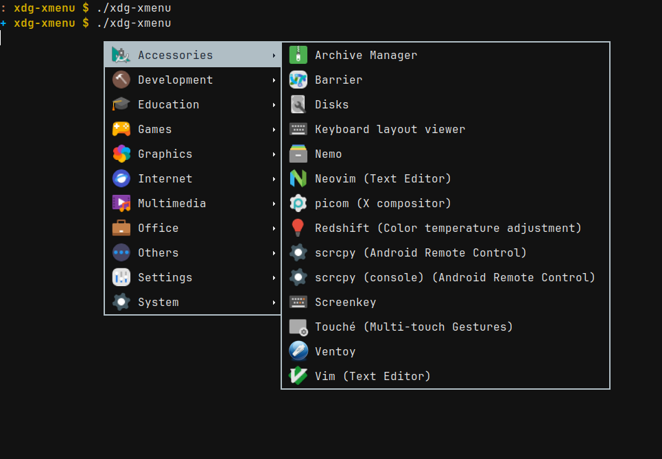

# xdg-xmenu



It's a small program to show a apps menu with [xmenu](https://github.com/phillbush/xmenu). The current branch is a C rewrite of previous shell and python version of `xdg-xmenu`. This C version can launch xmenu directly, due to a faster execution time.

For the legacy shell and python versions, see corresponding branches of this git repository.

## Requirements

- [libinih](https://github.com/benhoyt/inih), or called 'inih', to parse the desktop entry files.
  [Available](https://repology.org/project/inih/versions) in most major distros.

## Usage

```
xdg-xmenu [-dGhIn] [-b ICON] [-i THEME] [-s SIZE] [-S SCALE] [-t TERMINAL]
          [-x CMD] [-- <xmenu_args>]

A simple app menu with xmenu.

Options:
  -h          Show this help message and exit
  -b ICON     Fallback icon name, default is application-x-executable
  -d          Dump generated menu, do not run xmenu
  -G          Do not show generic name of the app
  -i THEME    Icon theme for app icons. Default to gtk3 settings
  -I          Disable icon in xmenu
  -n          Do not run app, output to stdout
  -s SIZE     Icon size for app icons
  -S SCALE    Icon scale factor, useful in HiDPI screens
  -t TERMINAL Terminal emulator to use, default is xterm
  -x CMD      Xmenu command to use, default is xmenu
Note:
  Options after `--' are passed to xmenu (or CMD)
```

## Notes

**Important:** Svg icons are supported since Imlib2 1.8.0. Thus, `xdg-xmenu` assumes that you have installed Imlib2 of at least that version. As a result, unlike the shell version, the svg icons are not converted to png anymore. If you don't have the required version of Imlib2, use the shell version instead.
