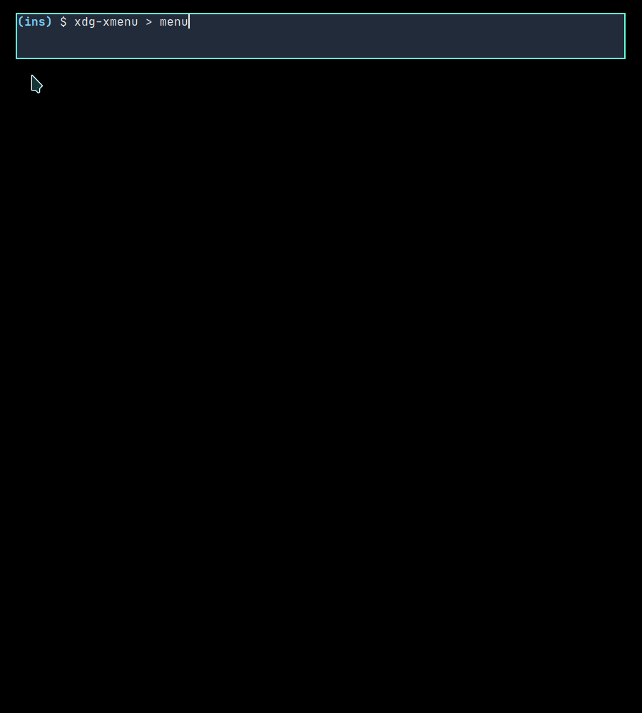

# xdg-xmenu

**Note:** A python version is being (or has been) worked on, which is a little bit faster. The shell version probably won't get feature updates anymore.

`xdg-xmenu` is a small shell script to generate xdg desktop menu file for [xmenu](https://github.com/phillbush/xmenu), a simple x11 menu utility.

This script is only a toy project and I have not tested it outside of my own machine, so bugs are expected and feel free to report them here.

## Requirement

**Update:** Since Imlib2 1.8.0, svg images can be rendered directly, so the following caching can be skipped. Recent `xdg-xmenu` provides a `-S` option to use the svg paths, see usage below.

The script will look for icons loosely according to [freedesktop specification](https://specifications.freedesktop.org). If the icons found are svg images, which is very possible, you will need any one of the following tools (sorted by priority) to convert svg images to pngs:

- `rsvg-convert`: provided by `librsvg` package, it is the fastest one among the three.
- `convert`: provided by `imagemagick` package.
- `inkscape`: this is about as fast (or slow) as `convert`

The generated png images will be cached to `~/.cache/xdg-xmenu/icons` folder. As a result, the first time running this script might cost some time.

## Usage

```
xdg-xmenu [-a] [-b fallback_icon] [-f] [-i icon_theme] [-n] [-s icon_size] [-t terminal]

Options
  -a  Show icons with `OnlyShowIn' key in .desktop file. These desktop entries are
      usually programs specifically for desktop environments. Default is not show‐
      ing those desktop entries.

  -b fallback_icon
      Fallback icon in case one can not be found. Both an icon name and a file
      path is acceptable. Default is application-x-executable.

  -f  Force to cache svg icons to png, even if cached images already exist. Useful
      when switching to a new icon theme.

  -i icon_theme
      Icon theme. Default is parsed from gtk3 configuration file.

  -n  Dry run mode. The conversion of svg images will be skipped. In others words,
      there is no file operations. The menu will still be printed with all the
      icon paths.

  -s icon_size
      Icon size. Default is 24.

  -S  Do not cache svg icons, use svg files directly. Supported since Imlib2 1.8.0.

  -t terminal
      Terminal emulator to use. Default is xterm.
```

To use it, you can redirect the output to a file and then feed it to `xmenu` by

```sh
$ xdg-xmenu > menu; xmenu < menu | sh &
```

Piping directly to `xmenu` is not recommended due to the slow speed.

[xmenu-apps](xmenu-app) is an example script.

### Configuration

The command line options can also be replaced with environment variables:
- `XDG_MENU_FALLBACK_ICON`: set fallback icon
- `XDG_MENU_ICON_SIZE`: set icon size
- `XDG_MENU_ICON_THEME`: set icon theme
- `XDG_MENU_SHOW_ALL`: show 'OnlyShowIn' apps
- `XDG_MENU_TERMINAL`: set terminal emulator

## Screenshot


